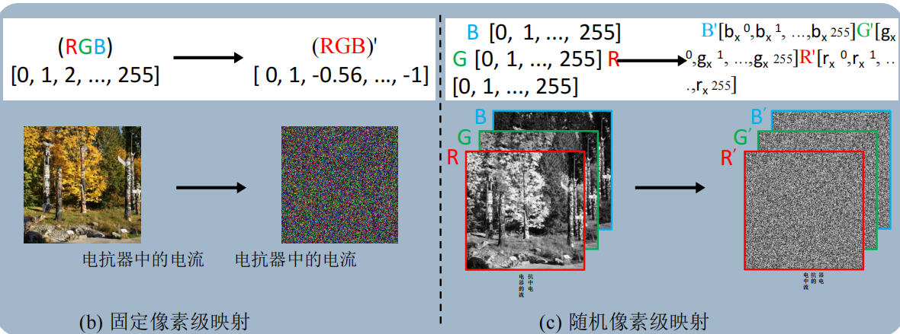
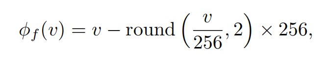
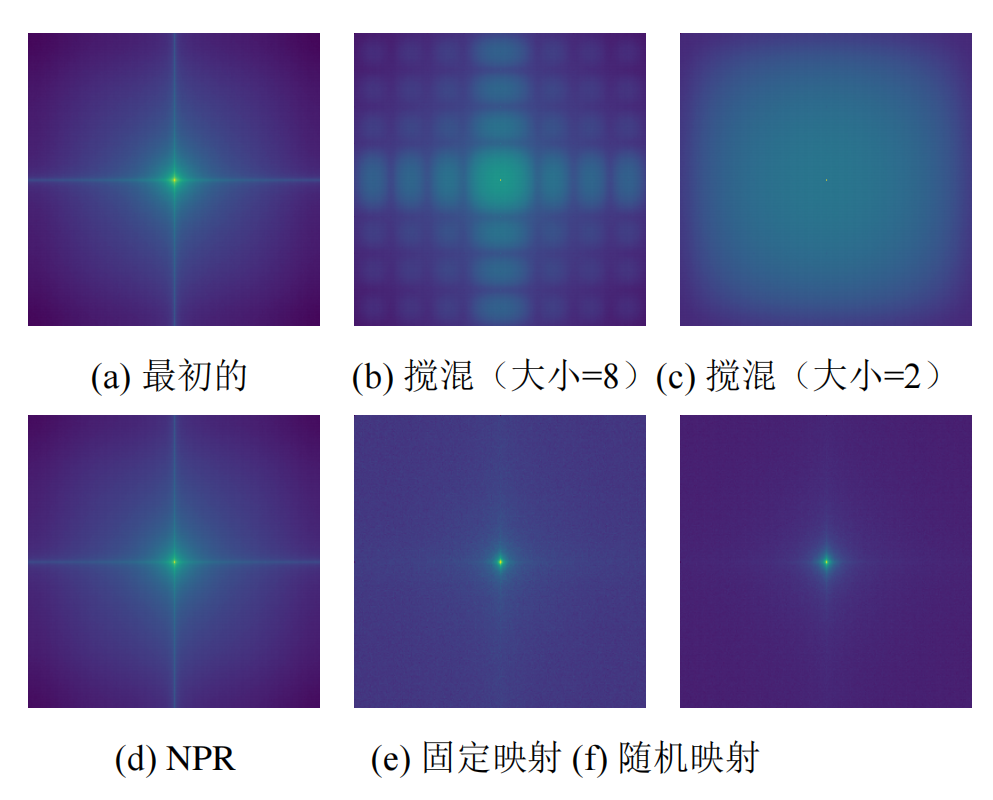
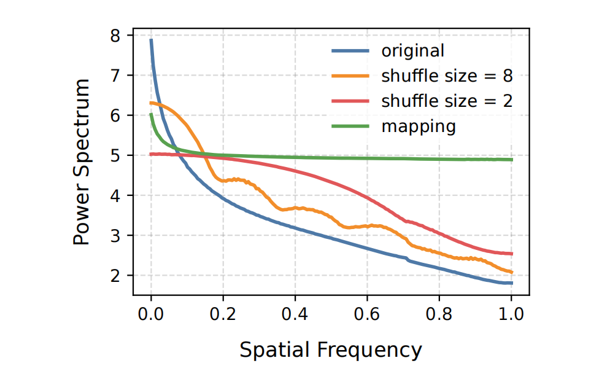
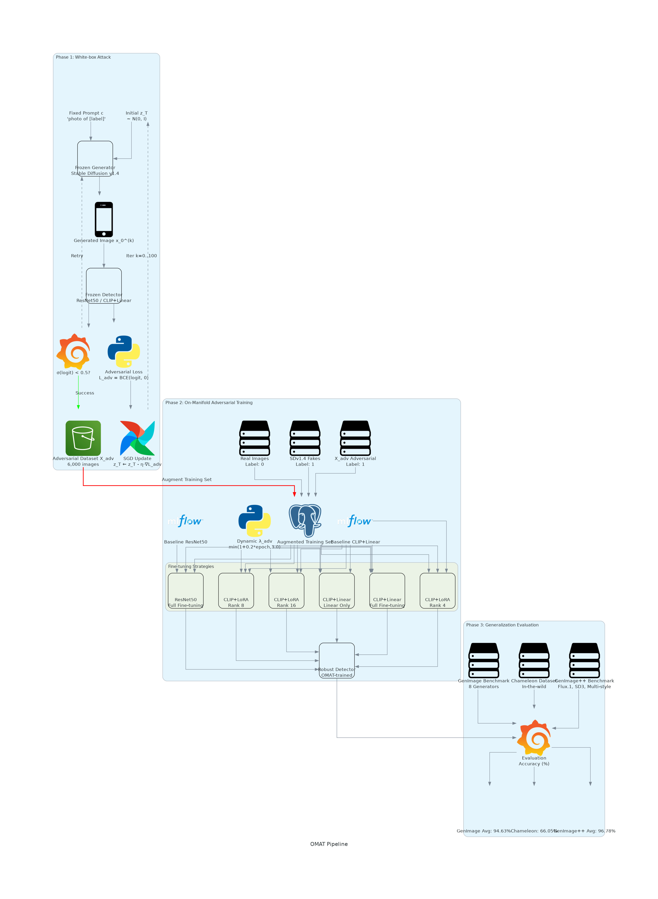

# 1. beyond semanic features: pixel-level mapping for general AI-generated image detection

### 对输入图像进行二分类任务以判断其是否是生成模型合成的
训练好的分类器分别需要满足
1. 类内泛化的能力：
即同一模型家族或者架构检测精度能够保持高水准(如从styleGAN到BigGAN，从Stable Diffusion的V1.4到V1.5)
2. 跨类别的泛化能力：
能迁移在未经训练的模型上仍能保持良好的泛化能力

### 直接在RGB模型上训练的泛化能力会受限：
1. 不同生成模型因为架构差异和训练流程不同，会产生各自独特的不同的语义伪影
2. 随着生成模型的改进，其输出结果越来越接近真实数据的分布，在高保真样本中检测语义级伪影会更加困难

### 现在的研究普遍认为
语义偏差于低频图像的平滑成分有关，生成式痕迹则与高频痕迹有关
而卷积会加剧训练过程的语义主导性

### 论文提出了一种方法：像素级映射方法 pixel-level mapping

#### 思想：
通过将单调有序的像素值映射成一组新的像素值，从而改变相邻像素的紧密空间排列
达到**既将低频信息转变成高频信息的效果，又达到了像素间的相关性的效果** 具体的框架如下

再输入分类头之前，将图像进行像素级映射，**扩大了图像各个像素值之间的差异而将低频信息转换成了高频信息**
#### 下图左是一种固定的映射方式，但是关键是打乱图像像素值之间固定的单调排列，因此下图右是随即映射方式

映射公式为

(对于每个通道(即颜色通道都保持一样的映射方式))
#### 总之文章是讲述了一种预处理手段
下为频率谱

下为功率谱

从二图我们可以看到，其在映射的处理后，图像的频率，功率非常的平稳均匀，使分类器能够**没有歧视性的**学习图像的特征；而且图像像素值的相对位置并没有改变，这保证了像素间的相关性没有改变
#### 最后性能的话
    在GenImage数据集上，固定映射平均准确率达98.4%，超过C2P-CLIP（95.8%）和UnivFD（88.8%），验证了泛化能力提升

# 2. breaking latent prior bias in detectors for generalizable AIGC image detection
#### 思想
当前的AIGC检测器在他们的training generator生成的的图像上表现良好，但是面对没有见过的generative architecture的时候就会表现出明显的表现下降
具体的思想是，固定generator和prompt text，然后让generator生成伪造图像，每一步都用baseline detector进行检测，然后当满足50%以下的标准(也就是错误识别该图片为真)，就保存该图片; 这种方式被称为了流形上对抗训练On-manifold adversarial training(OMAT),以此的话能够更快的学到真正的的robust features.而不是learning short-cut
#### 方法
**大概的粗略的**流程图如下

#### 第一步是: 利用流式对抗训练(OMAT)在REANET50和CLIP+Linear上得到adversarial dataset
#### 第二步是: 实际训练的时候数据集的组成有
    1. 真实图片
    2. SDv1.4生成的图片
    3. 第一部得到的对抗样本
#### 然后利用训练好的模型进行下一步
#### 第三步是: 评估结果
    GenImage Avg: 94.63%
    Chameleon: 66.05%
    GenImage++ Avg: 96.78%